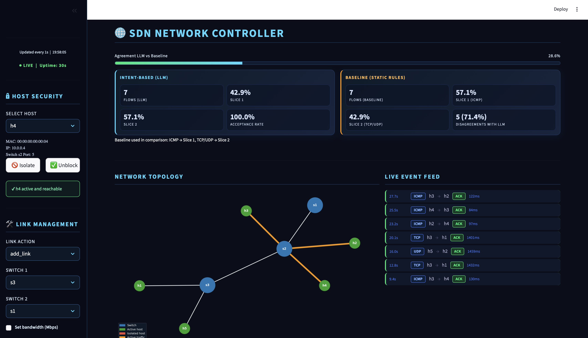

# LLM-Driven SDN Network Slicing

Course project for **Softwarized and Virtualized Mobile Networks** (A.Y. 2025–2026),
M.Sc. in Computer Science — University of Trento.

This project adds an LLM as a **northbound control intelligence layer** on top of a RYU SDN controller.
The model receives compact network state snapshots and decides how to steer traffic and handle anomalies.

## Table of contents

- [Dashboard](#dashboard)
- [What the system does](#what-the-system-does)
- [Deployment architecture](#deployment-architecture)
- [High-level software architecture](#high-level-software-architecture)
- [Repository structure](#repository-structure)
- [Quick start](#quick-start)
- [LLM loop behavior](#llm-loop-behavior)
- [Outputs and observability](#outputs-and-observability)
- [Notes](#notes)
- [Technologies](#technologies)

## Dashboard



## What the system does

The platform runs on Mininet + Open vSwitch + RYU and uses the LLM for three tasks:

- **Slice assignment** (`ask_slice`) for each new flow.
- **Anomaly detection** (`ask_anomaly`) on periodic monitoring windows.
- **Automatic remediation** (`ask_fix`) when anomalies are actionable.

### Network slices

| Slice | Queue | Profile | Typical traffic |
|---|---|---|---|
| Slice 1 | Queue 1 | Low latency / high priority | ICMP, interactive |
| Slice 2 | Queue 2 | High throughput / bulk | TCP, UDP |

## Deployment architecture

The system is split across two machines:

| Component | Host |
|---|---|
| Mininet + OVS + RYU + experiment engine | **Multipass VM** (Ubuntu guest) |
| Streamlit dashboard | **macOS host** |

The project directory is shared via **Multipass mount**. Runtime files written by the experiment (`network/data/`) are read directly by the dashboard on the host without any network transfer.

```
┌─────────────────────────────┐      ┌──────────────────────────────────┐
│        macOS host           │      │        Multipass VM (Ubuntu)     │
│                             │      │                                  │
│  streamlit run gui/         │      │  sudo python3                    │
│    Dashboard.py             │      │    network/networkGeneration.py  │
│         │                   │      │         │                        │
│         │ read              │      │         │ write                  │
│         ▼                   │      │         ▼                        │
│   network/data/  ◄──────────┼──────┼── network/data/                 │
│  (Multipass mount)          │      │  (shared filesystem)             │
│         │                   │      │                                  │
│         │   RYU REST API    │      │                                  │
│         └───────────────────┼─────►│  :8080                          │
└─────────────────────────────┘      └──────────────────────────────────┘
```

## High-level software architecture

```text
LLM (OpenAI Responses API)
       ↑
       ↓
Northbound Python logic (LLMClient)
       ↑
       ↓
RYU REST API (ofctl_rest)
       ↑
       ↓
RYU controller + OpenFlow 1.3
       ↑
       ↓
OVS switches + Mininet hosts
```

## Repository structure

| Path | Role |
|---|---|
| `network/networkGeneration.py` | Main experiment orchestrator |
| `network/networksGenerator.py` | Topology generation + QoS queue setup |
| `network/llmClient.py` | OpenAI client + prompting + parsing + logging |
| `network/networkMonitor.py` | Periodic monitoring, anomaly detection, auto-fix |
| `network/trafficManager.py` | Random traffic generation + LLM-driven slice installation |
| `network/ryuController.py` | RYU REST wrapper |
| `network/metricStore.py` | Thread-safe metrics and persistence |
| `network/templates/system.j2` | System prompt (role, constraints) |
| `network/templates/slice_intent.j2` | Slice assignment prompt |
| `network/templates/slice_intent_delta.j2` | Slice assignment prompt (delta-state variant) |
| `network/templates/anomaly_intent.j2` | Anomaly classification prompt |
| `network/templates/fix_intent.j2` | Remediation action prompt |
| `network/templates/query_user.j2` | User-initiated query prompt |
| `gui/Dashboard.py` | Streamlit dashboard entrypoint |
| `gui/SidebarManager.py` | Host security controls (isolate/unblock) and link management |
| `gui/Visualizer.py` | Network topology graph rendering |
| `gui/DataLoader.py` | Metrics and topology JSON loader |
| `gui/SDNController.py` | GUI action queue client (enqueue/result polling) |
| `gui/config.py` | Path resolution and environment variable loading |

## Quick start

### 1) Prerequisites

The experiment engine (Mininet + RYU) must run on Linux. The Streamlit dashboard can run on any OS.

| Setup | When to use |
|---|---|
| **macOS / Windows host + Multipass VM** | Development on a non-Linux machine (recommended) |
| **Native Linux** | Run everything locally — no VM needed |

**Experiment machine (Linux / Multipass VM)**
- Python 3.8+
- Mininet + Open vSwitch
- RYU SDN framework (`pip install ryu`)

**Dashboard machine (macOS / Windows / Linux host)**
- Python 3.8+
- OpenAI API key
- Multipass (only if using the VM approach)

### 2) Share the project directory

**macOS / Windows — mount into the VM:**
```bash
# Replace <vm-name> with your Multipass VM name
multipass mount /path/to/LLMIntent <vm-name>:/home/ubuntu/LLMIntent
```

**Native Linux — no mount needed:** clone the repo on the same machine and run both the experiment and the dashboard from the same directory.

This gives the VM write access to `network/data/`, which the dashboard reads directly on the host.

### 3) Install dependencies

**On the VM:**
```bash
pip install openai requests jinja2
```

**On the macOS host:**
```bash
pip install openai requests jinja2 streamlit matplotlib plotly pandas networkx
```

### 4) Configure environment

```bash
cp .env.example .env
```

Key `.env` values:

```env
OPENAI_API_KEY=sk-...
VM_IP=<vm-ip>          # single source of truth — all RYU URLs are derived from this
EXPERIMENT_RUNTIME=120
```

To find the VM IP: `multipass info <vm-name>`. The IP may change on restart — `VM_IP` is the only value you need to update.

Useful optional settings:

- `OPENAI_MODEL` (default: `gpt-4.1-mini`)
- `NUM_SWITCHES`, `NUM_HOSTS`
- `ANOMALY_CHECK_INTERVAL` (seconds between monitoring cycles, default: 30)
- `REFRESH_SEC` (dashboard refresh rate, default: 1)
- `ADD_URL`, `DEL_URL` (explicit RYU REST endpoint overrides)

### 5) Run the experiment

**On the VM**, from the project root:

```bash
sudo python3 network/networkGeneration.py
```

### 6) Run the dashboard

**On the macOS host**, from the project root:

```bash
streamlit run gui/Dashboard.py
```

## LLM loop behavior

### Slice assignment (per flow)

1. Collect compact flow/state context.
2. Ask the model for `slice: 1|2` with short reason.
3. Install OpenFlow rules with `SET_QUEUE` accordingly.

### Anomaly detection (periodic)

1. Build anomaly signals (drop rate, latency stats, flow growth, etc.).
2. Ask the model for anomaly classification.
3. If anomaly is actionable, request remediation action (`block_host`, `set_link_tc`, `add_link`, `remove_link`, or `none`).
4. Apply fix through RYU REST / Mininet and log decision metadata.

## Outputs and observability

All runtime files are written to `network/data/`:

| File | Content |
|---|---|
| `network/data/metrics.json` | Live traffic metrics read by the dashboard |
| `network/data/topology.json` | Network topology generated at startup |
| `network/data/llm_calls.jsonl` | Full audit log of every LLM call |
| `network/data/gui_actions.jsonl` | Actions queued from the GUI |
| `network/data/gui_actions_results.jsonl` | Execution results of GUI actions |

Dashboard sections:
- topology and host isolation state
- baseline vs LLM comparison
- LLM activity and raw latest call details

## Notes

- Keep secrets only in `.env` (gitignored).
- **Multipass**: the VM IP may change on restart — run `multipass info <vm-name>` and update `VM_IP` in `.env`. All RYU URLs are derived from it automatically.
- **Native Linux**: leave `VM_IP=127.0.0.1` (the default).
- If Mininet is left dirty, run on the VM:

```bash
sudo mn -c
```

## Technologies

- SDN: RYU, OpenFlow 1.3, Open vSwitch
- Emulation: Mininet
- Virtualisation: Multipass (Ubuntu VM on macOS)
- LLM: OpenAI Responses API
- UI: Streamlit
- Prompting: Jinja2 templates

## Author

- Sara Soprana — sara.soprana@studenti.unitn.it